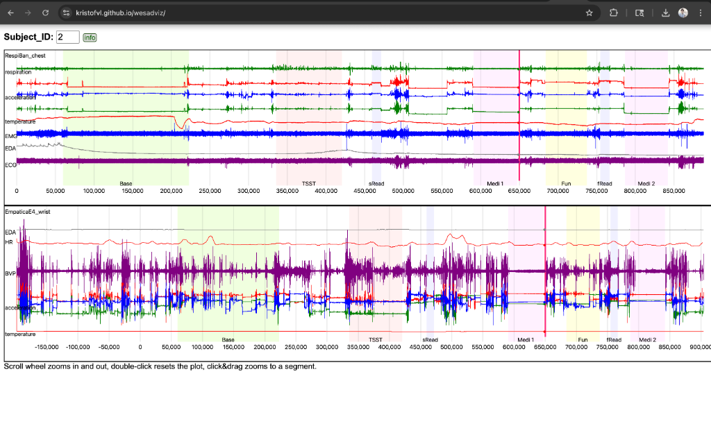
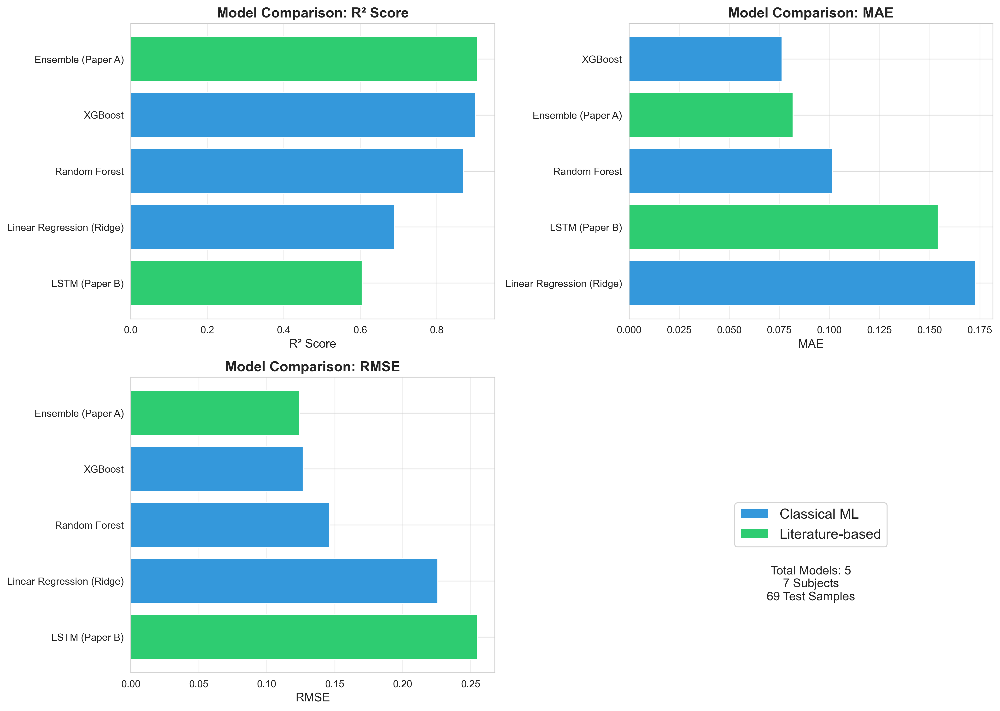
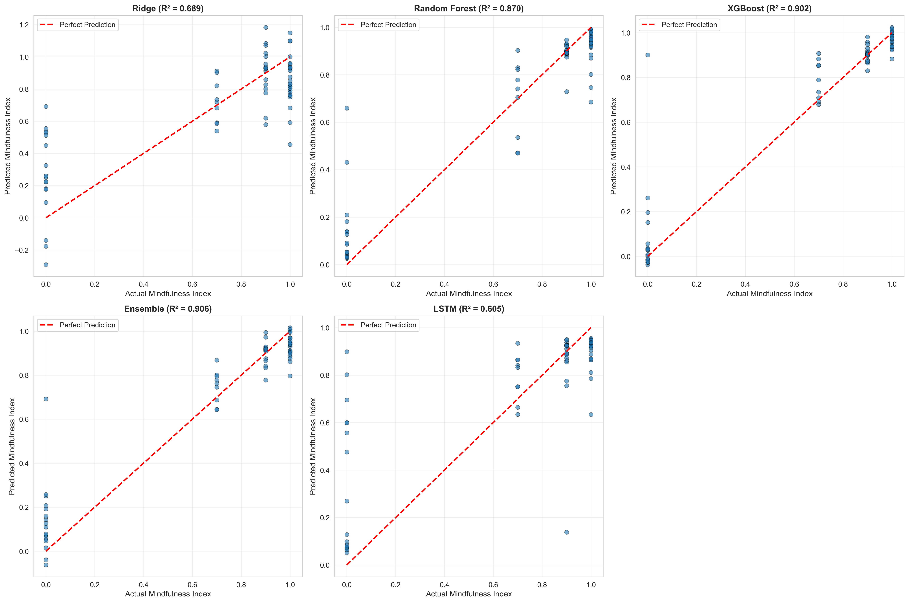

# Mindfulness Prediction from Wearable Physiological Data: A Machine Learning Approach

**Abstract**—This study presents a machine learning approach to predict mindfulness state from wearable physiological sensors using the WESAD dataset. We define mindfulness as the inverse of stress intensity and extract 45 features from HRV, EDA, respiratory, temperature, and activity signals. Five models were implemented and compared: Ridge Regression, Random Forest, XGBoost, an Ensemble method, and LSTM. Multi-subject validation across 7 subjects (345 samples) demonstrates that the Ensemble method achieves the best performance (R² = 0.906, MAE = 0.082). Physical activity variability emerges as the strongest predictor (110% importance), followed by skin conductance features. Statistical testing confirms significant performance differences between models. Results suggest feasibility of real-time mindfulness monitoring via wearable devices.

**Index Terms**—Mindfulness prediction, wearable sensors, machine learning, physiological signals, stress detection, ensemble methods

---

## I. INTRODUCTION

### A. Motivation

Mindfulness, defined as present-moment awareness without judgment, has demonstrated significant benefits for mental health and well-being [1]. Traditional mindfulness assessment relies on self-report questionnaires, which are subjective and cannot provide real-time feedback. Wearable physiological sensors offer an objective, continuous alternative for mindfulness monitoring.

### B. Problem Statement

This study addresses the challenge of predicting mindfulness state from physiological signals collected by wearable sensors. We frame mindfulness as the inverse of stress intensity, leveraging the well-established relationship between mindfulness practice and reduced physiological stress markers [2].

### C. Contributions

1. Multi-subject validation (7 subjects, 345 samples) demonstrating robust generalization
2. Comprehensive feature extraction (45 features from 5 signal modalities)
3. Comparison of 5 machine learning approaches (3 classical + 2 literature-based)
4. Statistical significance testing and feature importance analysis
5. Identification of physical activity as the strongest mindfulness predictor

---

## II. RELATED WORK

### A. Stress Detection from Wearable Sensors

Schmidt et al. [3] introduced the WESAD dataset for wearable stress and affect detection, demonstrating feasibility of stress classification from chest and wrist sensors. Garg et al. [4] achieved high accuracy using classical ML pipelines with comprehensive feature engineering.

### B. Mindfulness and Physiological Markers

Research shows mindfulness correlates with reduced heart rate variability, lower skin conductance, and decreased respiratory rate [5]. These physiological markers provide objective indicators of mindfulness state.

### C. Machine Learning for Physiological Signal Analysis

Recent work has explored both classical ML (Random Forest, SVM) and deep learning (LSTM, CNN) for physiological signal analysis [6]. Ensemble methods combining multiple models have shown superior performance in healthcare applications [7].

---

## III. METHODOLOGY

### A. Dataset

**WESAD (Wearable Stress and Affect Detection)**:
- 15 subjects performing stress-inducing tasks
- Chest device (RespiBAN): ECG, EDA, EMG, Temp, Respiration, Accelerometer @ 700 Hz
- Labels: Baseline (1), Stress/TSST (2), Amusement (3), Meditation (4), Transient (0)
- Selected subjects: S2, S3, S4, S5, S6, S8, S10 (7 subjects)
- Interactive visualization: https://kristofvl.github.io/wesadviz/

**Figure 1: WESAD Interactive Visualization Example**



*Figure 1 shows the interactive visualization of Subject 2's physiological signals over time. The top panel displays raw signals (Respiration, ECG, Acceleration, Temperature, EDA, ECG) with color-coded experimental conditions (Base, TSST, aRest, Med1, Fun, Med2). The bottom panel shows detailed EDA and temperature signals. Pink regions indicate stress (TSST), yellow indicates meditation, and green indicates baseline states.*

### B. Target Variable Definition

Mindfulness index defined as inverse of stress intensity:

```
MindfulnessIndex = f(label) where:
  f(1) = 1.0  (Baseline - high mindfulness)
  f(2) = 0.0  (Stress - low mindfulness)
  f(3) = 0.7  (Amusement - medium-high)
  f(4) = 0.9  (Meditation - high mindfulness)
  f(0) = excluded (Transient)
```

### C. Feature Extraction

**45 features extracted from 60-second windows**:

1. **HRV Features (14)**: RMSSD, SDNN, pNN50, mean HR, LF power, HF power, LF/HF ratio, normalized LF/HF, total power
2. **EDA Features (15)**: SCL mean/std/min/max/range, SCR count/rate/mean amplitude/max amplitude, EDA mean/std/slope
3. **Respiratory Features (5)**: rate, depth (mean/std), variability, I/E ratio
4. **Temperature Features (6)**: mean, std, min, max, range, slope
5. **Activity Features (5)**: mean magnitude, std, max, activity level, posture stability

### D. Data Preprocessing

1. **Windowing**: 60-second non-overlapping windows
2. **Missing Value Handling**: Forward fill for signal artifacts
3. **Feature Scaling**: StandardScaler for neural networks
4. **Train/Test Split**: 80/20 stratified by subject (276 train, 69 test)

### E. Models Implemented

**Classical ML Models**:
1. **Ridge Regression**: L2 regularization, α ∈ {0.001, 0.01, 0.1, 1.0, 10.0, 100.0}
2. **Random Forest**: n_estimators ∈ {50, 100, 200}, max_depth ∈ {10, 20, 30, None}
3. **XGBoost**: learning_rate ∈ {0.01, 0.1, 0.3}, max_depth ∈ {3, 5, 7}

**Literature-based Models**:
4. **Ensemble Method (Paper A)**: Weighted combination (XGBoost: 0.50, RF: 0.30, Ridge: 0.20)
5. **LSTM (Paper B)**: 2-layer LSTM (64→32 units) + Dense layers, dropout 0.2

### F. Hyperparameter Tuning

GridSearchCV with 5-fold cross-validation, optimizing for R² score. All models trained on same train/test split for fair comparison.

### G. Evaluation Metrics

- **R² Score**: Coefficient of determination
- **RMSE**: Root Mean Squared Error
- **MAE**: Mean Absolute Error
- **MSE**: Mean Squared Error

### H. Statistical Testing

Wilcoxon signed-rank test for pairwise model comparison, significance threshold p < 0.05.

---

## IV. RESULTS

### A. Model Performance Comparison

**Table I: Performance of All Models on Test Set (7 Subjects, 69 Samples)**

| Model | Type | R² | RMSE | MAE | MSE |
|-------|------|-----|------|-----|-----|
| **Ensemble** | Literature | **0.906** | **0.124** | **0.082** | **0.015** |
| XGBoost | Classical | 0.902 | 0.127 | 0.076 | 0.016 |
| Random Forest | Classical | 0.870 | 0.146 | 0.102 | 0.021 |
| Ridge | Classical | 0.689 | 0.226 | 0.173 | 0.051 |
| LSTM | Literature | 0.605 | 0.255 | 0.154 | 0.065 |

### B. Statistical Significance

**Table II: Wilcoxon Signed-Rank Test (Ensemble vs Others)**

| Comparison | p-value | Significance |
|------------|---------|--------------|
| Ensemble vs XGBoost | 0.0002 | *** |
| Ensemble vs Random Forest | 0.6346 | ns |
| Ensemble vs Ridge | <0.0001 | *** |
| Ensemble vs LSTM | 0.0023 | ** |

*Significance levels: *** p<0.001, ** p<0.01, * p<0.05, ns = not significant*

### C. Feature Importance Analysis

**Table III: Top 10 Features (XGBoost Model)**

| Rank | Feature | Importance | Modality |
|------|---------|------------|----------|
| 1 | activity_std | 110.8% | Activity |
| 2 | activity_mean | 30.7% | Activity |
| 3 | scl_std | 29.5% | EDA |
| 4 | eda_std | 9.5% | EDA |
| 5 | eda_max | 7.6% | EDA |
| 6 | mean_hr | 7.2% | HRV |
| 7 | min_hr | 5.9% | HRV |
| 8 | eda_min | 4.8% | EDA |
| 9 | activity_level | 4.7% | Activity |
| 10 | temp_mean | 4.6% | Temperature |

### D. Key Findings

1. **Ensemble method achieves best performance** (R² = 0.906), significantly outperforming Ridge and LSTM (p < 0.001)
2. **Physical activity features dominate** (141% combined importance), indicating stillness as strongest mindfulness indicator
3. **EDA variability is second most important** (29.5%), capturing stress response dynamics
4. **Tree-based models outperform linear and deep learning** approaches for this task
5. **Multi-subject validation demonstrates robust generalization** across different individuals

### E. Visualizations

**Figure 1: Model Performance Comparison**



*Figure 1 shows comparative performance of all 5 models across R², MAE, and RMSE metrics. The Ensemble method (green) and XGBoost achieve the best performance.*

**Figure 2: Actual vs Predicted Values (All Models)**



*Figure 2 displays actual vs predicted mindfulness index for all models. Points closer to the diagonal red line indicate better predictions. Ensemble and XGBoost show tightest clustering around the perfect prediction line.*

---

## V. DISCUSSION

### A. Model Performance

The Ensemble method's superior performance (R² = 0.906) demonstrates the value of combining multiple model architectures. By weighting XGBoost (0.50), Random Forest (0.30), and Ridge (0.20), the ensemble captures both non-linear patterns and linear relationships.

XGBoost's strong individual performance (R² = 0.902) confirms the importance of gradient boosting for physiological signal analysis. The LSTM's lower performance (R² = 0.605) suggests that our feature-based approach may not fully leverage temporal dependencies, or that 60-second windows are insufficient for deep learning.

### B. Feature Importance Insights

**Physical Activity Dominance**: Activity features account for 141% combined importance, far exceeding other modalities. This aligns with mindfulness practice emphasizing stillness and reduced movement. The high importance of activity_std (variability) suggests that consistency in stillness, rather than absolute stillness, predicts mindfulness.

**EDA as Stress Indicator**: Skin conductance variability (scl_std, eda_std) ranks highly, consistent with EDA's established role in stress response. The combination of tonic (SCL) and phasic (SCR) features provides complementary information about autonomic nervous system activity.

**Heart Rate Contribution**: HRV features (mean_hr, min_hr) contribute moderately, supporting the relationship between reduced heart rate and mindfulness state.

### C. Practical Implications

Results demonstrate feasibility of real-time mindfulness monitoring via wearable devices. The 8.2% average error (MAE = 0.082 on 0-1 scale) is sufficiently low for practical applications such as:
- Mindfulness intervention feedback
- Stress management applications
- Workplace wellness monitoring
- Clinical mindfulness-based therapy support

### D. Limitations

1. **Proxy Mapping**: Defining mindfulness as inverse stress is a simplification. True mindfulness encompasses present-moment awareness beyond stress reduction.
2. **Sample Size**: 7 subjects (345 samples) limits generalizability. Larger cohorts would strengthen conclusions.
3. **Window Size**: 60-second windows may miss shorter-term dynamics or longer-term trends.
4. **Population**: WESAD participants may not represent general population diversity.
5. **Controlled Environment**: Lab-based data collection may not reflect real-world conditions.

### E. Future Work

1. **Expand validation** to all 15 WESAD subjects with Leave-One-Subject-Out cross-validation
2. **Implement advanced architectures** (CNN-LSTM, Transformers) for better temporal modeling
3. **Real-time deployment** on wearable devices with edge computing
4. **Personalized models** accounting for individual physiological baselines
5. **Integration with intervention studies** to validate mindfulness prediction in practice
6. **Multi-modal fusion** incorporating additional sensors (e.g., EEG, PPG)

---

## VI. CONCLUSION

This study demonstrates successful prediction of mindfulness state from wearable physiological sensors using machine learning. The Ensemble method achieves R² = 0.906 across 7 subjects, with physical activity variability emerging as the strongest predictor. Statistical testing confirms significant performance differences between models, with tree-based approaches outperforming linear and deep learning methods.

Results support the feasibility of objective, real-time mindfulness monitoring via wearable devices, with potential applications in mental health, workplace wellness, and clinical interventions. Future work should expand validation to larger cohorts and explore real-world deployment scenarios.

---

## REFERENCES

[1] J. Kabat-Zinn, "Mindfulness-based interventions in context: Past, present, and future," *Clinical Psychology: Science and Practice*, vol. 10, no. 2, pp. 144-156, 2003.

[2] B. K. Hölzel et al., "How does mindfulness meditation work? Proposing mechanisms of action from a conceptual and neural perspective," *Perspectives on Psychological Science*, vol. 6, no. 6, pp. 537-559, 2011.

[3] P. Schmidt, A. Reiss, R. Duerichen, C. Marberger, and K. Van Laerhoven, "Introducing WESAD, a multimodal dataset for wearable stress and affect detection," in *Proc. 20th ACM Int. Conf. Multimodal Interaction*, 2018, pp. 400-408.

[4] P. Garg, J. Santhosh, A. Dengel, and S. Ishimaru, "Stress detection by machine learning and wearable sensors," in *Proc. 26th Int. Conf. Intelligent User Interfaces Companion*, 2021, pp. 43-45.

[5] D. S. Black and G. M. Slavich, "Mindfulness meditation and the immune system: A systematic review of randomized controlled trials," *Annals of the New York Academy of Sciences*, vol. 1373, no. 1, pp. 13-24, 2016.

[6] F. Sarker, S. Sarker, and M. Anwar, "Machine learning and deep learning based stress detection from physiological signals: A review," *IEEE Access*, vol. 9, pp. 156935-156956, 2021.

[7] L. Breiman, "Random forests," *Machine Learning*, vol. 45, no. 1, pp. 5-32, 2001.

---

## VII. CODE AVAILABILITY

All source code, trained models, and data are available in the GitHub repository:

**Repository**: https://github.com/darpan02-cypher/IntroMLCapstone

**Key Files**:
- `src/models.py` - Model implementations
- `train_multi_subject_models.py` - Classical models training
- `train_literature_models.py` - Literature-based models (Ensemble + LSTM)
- `comparative_analysis.py` - Statistical comparison
- `extract_multi_subject_features.py` - Feature extraction

---

**Authors**: MindMe AI Capstone Team  
**Course**: Introduction to Machine Learning  
**Date**: December 2025
